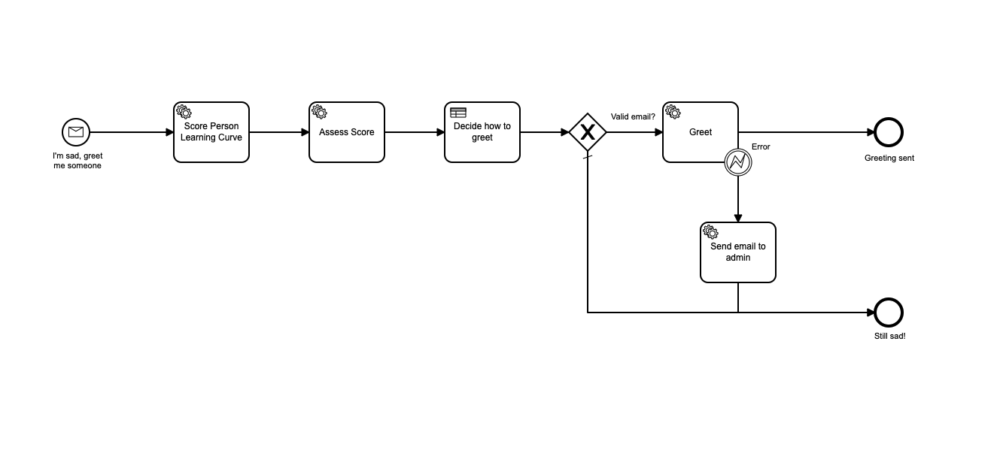

# Camunda, Zeebe and Dapr

Goal of this example is to try features available by Camunda workflow and Zeebe automation processing framework with Dapr to make coding as much as independent as possible. 

## The process description

Expecting a sad person having difficulties learning a new language and it would make her happier if someone greets her. But depending on her learning skills (Score Person Learning Curve) she may desire the greeting or not. If her score is more than 30% she receives greeting by email. If less, it generates a business error and sends email to administrator. Yes, cruel world.

### BPMN Workflow

### Decide how to greet

 

Request greeting and watch processing to the end.

## How to install

### Docker (Docker Compose)

1. Install [Dapr](https://docs.dapr.io/getting-started/install-dapr-cli/) on local machine
2. Run start-all.ps1 in deploy/docker directory.

When finished run stop-all.ps1 in deploy/docker directory.

### Kubernetes

1. Install [Dapr](https://docs.dapr.io/getting-started/install-dapr-cli/) to Kubernetes either with CLI or Helm charts
2. Run start-all.ps in deploy/k8s directory.

When finished run stop-all.ps1 in deploy/k8s directory.

## How to test

1. Navigate to [MailDev](http://localhost:4000/) to see testing emails coming
2. Navigate to [Camunda cloud self hosted](http://localhost:8080/)

    user: demo\
    password: demo

3. Install and use Camunda Modeler (https://downloads.camunda.cloud/release/camunda-modeler/5.4.2/) to see [BPMN diagram](src/api/Model/Greetings3.bpmn) and [DMN diagram](src/api/Model/greetings.dmn) and deploy both to Zeebe engine self-hosted. There is also a [playground](src/api/Model/decision-tester.bpmn) to test DMN workflows.

4. Ensure all containers are running. Start simulator in */src/sim* folder as `dotnet run` to process all messages or `dotnet run 10` to process just 10 messages. It's always good to start small first.

## Knows issues

Timezone doesn't work correctly on Mac/Windows in Camunda containers. It's left unresolved for now.

## Remarks

Throwing business error does not send the ErrorMessage to Camunda engine or at least it's not accessible in "Send email to admin" task. Hence setting the property explicitly - feels a bit akward to me.

Whatever I define in Input field is a string. Even though I'd expect it's Time as on. Then using it in DMN diagram is impossible (or don't know how) as it always ends with error comparing ValString and ValTime. 

