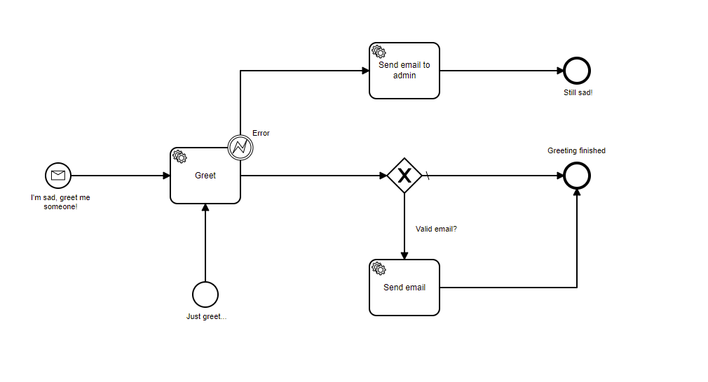

# Camunda, Zeebe and Dapr

Goal of this example is to try features available by Camunda workflow and Zeebe automation processing framework with Dapr to make coding as much as independent as possible. Workflow engine brings a great separation and automation of lifecycle. This is especially important for microservices and Camunda seems a feasible engine for cross platform solutions. Next step would be to add integration events, which will make processes even more separated.

## Use case / BPMN process

Request greeting and watch processing to the end.

## How to run

Best experience is from Visual Studio by running docker-compose launch adding debugging options, but it's not necessary.

1. Start docker-compose in Infrastructure folder by running `docker-compose up`. I left it separate as it it the background for my other projects.
2. Start `docker-compose up --build` in greetings-camunda folder. This should build the project and create docker image.
3. Navigate to [MailDev](http://localhost:4000/) for testing emails
4. Navigate to [Camunda cloud self hosted](http://localhost:8080/)

    user: demo\
    password: demo

5. Use Camunda Modeler to see BPMN diagram and deploy to web site - Model/Greetings2.bpmn
6. Execute REST queries located in requests folder, best from VS Code. Start by create-instance.http and experiment.

### Thanks

[Dapr](https://github.com/dapr/dapr) team, [Camunda](https://github.com/camunda-cloud) team 
and [Akkie](https://github.com/akkie) and his [samples](https://github.com/PlanBGmbH/zeebe-dapr-example) which saved me lots of hours while preparing this demo.
